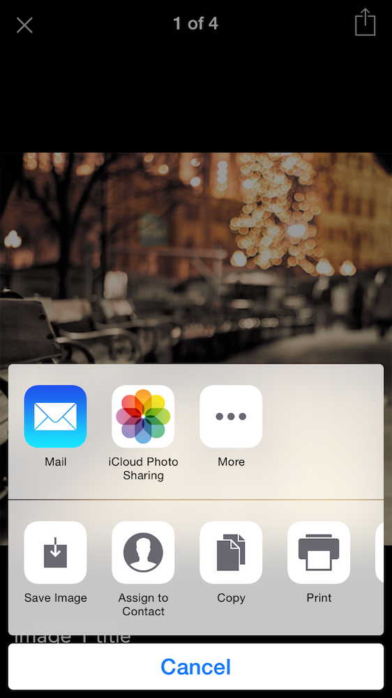

# NativeScript PhotoViewer
A simple image-viewer/gallery component for NativeScript. 

iOS | Android
--- | --- 
[NYTPhotoViewer](http://cocoadocs.org/docsets/NYTPhotoViewer/1.1.0/index.html) | [ImageGallery](https://github.com/lawloretienne/ImageGallery/)


Since the plugin is based on two different libraries for two different platforms their features are also somewhat diferent:

"NYTPhotoViewer" (iOS) is a slideshow and image viewer that includes double-tap to zoom, captions, support for multiple images, interactive flick to dismiss, animated zooming presentation, and more.

"ImageGallery" (Android) is a gallery used to host an array of external images (array of urls). It supports multiple images, double-tap to zoom and a gallery view. 

## Installation
Run  ```npm i nativescript-photoviewer``` in your ROOT directory of your project.

## Limitations
Captions only available on iOS. Android only supports array of string urls as datasource. 

## Usage
The usage is very simple. Require "nativescript-photoviewer" module and create a instance of it. Call the ```showViewer(array)``` function to present the photoViewer. 
The ```showViewer()``` function accept a singe parameter, an array. The array can contain one, or a mixture, of the following types:
- String URLs that point to external images (iOS & Android)
- Custom defined objects that contain image-data (image/imageURL, title, summary, credit) (iOS only)
- Objects that conform to the ```NYTPhoto``` protocol (see the cocoapod documentation for more info - very similar to the above option) (iOS only)

When using the second option, properties that one can use are defined below in the second example. The ```image``` conforms to the UIImage object, while the ```imageURL``` is a string containing the URL of the image.
If ```imageURL``` is set, then ```image``` is ignored. You can also customize fontFamily, fontSize and color of the caption texts. FontFamily applies to all captions, size and color are caption-specific.  

```js
// Require the module
var PhotoViewer = require("nativescript-photoviewer");
photoViewer = new PhotoViewer();

// Caption font-style settings (optional - iOS only)
photoViewer.fontFamily = "Avenir-Roman";
photoViewer.titleFontSize = 20;
photoViewer.summaryFontSize = 16;
photoViewer.creditFontSize = 14;
photoViewer.titleColor = UIColor.whiteColor();
photoViewer.summaryColor = UIColor.brownColor();
photoViewer.creditColor = UIColor.orangeColor();

// Image from object (iOS only)
var testImage1 = {
    imageURL: "https://somepage.com/image01.jpg",
    title: "Image 1 title",
    summary: "Image 1 summary",
    credit: "Telerik"
};
var testImage2 = {
    imageURL: "https://somepage.com/image01.jpg",
    title: "Image 2 title",
    summary: "Image 2 summary",
    credit: "Telerik"
};

//Image from URLs (Android & iOS)
var imageFromURL1 = "https://somepage.com/image01.jpg";
var imageFromURL2 = "https://somepage.com/image02.jpg";

// Add to array and pass to showViewer
var myImages = [testImage1, testImage2, imageFromURL1, imageFromURL2];
photoViewer.showViewer(myImages);
```

## Screenshots
 
 

## Help
I will accept pull requests that improve this and assign credit. 
All code is Apache 2.0 licensed.

## License
Copyright 2016 Nedim Erkocevic

Licensed under the Apache License, Version 2.0 (the "License");
you may not use this file except in compliance with the License.
You may obtain a copy of the License at

   http://www.apache.org/licenses/LICENSE-2.0

Unless required by applicable law or agreed to in writing, software
distributed under the License is distributed on an "AS IS" BASIS,
WITHOUT WARRANTIES OR CONDITIONS OF ANY KIND, either express or implied.
See the License for the specific language governing permissions and
limitations under the License.